## What is Data Ingestion?

The initial process of collecting and transporting data from various sources into a storage or processing system, such as a data warehouse, data lake, or analytics platform. It is the foundational step in building data pipelines, enabling organizations to centralize, analyze, and derive insights from their data. Common terminology in this area include:

- **Data Ingestion:** The general process of moving data from source systems to a target system.
- **Data Lake Ingestion:** Specifically refers to loading data into a data lake, which is a centralized repository for storing raw, unstructured, or structured data at scale.
- **Data Hydration:** Sometimes used interchangeably with ingestion, this term emphasizes the process of populating a data store (often a data lake or warehouse) with fresh data.
- **Data Pipeline:** A broader term that includes ingestion, transformation, and loading (ETL/ELT) steps.
- **Source-to-Target:** Describes the end-to-end flow of data from its origin (source) to its destination (target), often with mapping and transformation logic.

## Architecture

A cloud-agnostic pattern for data lake ingestion leverages serverless functions to move data from diverse sources into a centralized data lake, regardless of the underlying cloud provider (AWS, Azure, GCP, etc.). This approach enables organizations to build scalable, event-driven, and cost-effective ingestion pipelines that are portable across cloud platforms.

A well defined Landing Zone pattern is also strongly encouraged to keep data storage standardized and consistent in the Data Lake. Example of possible landing zones could include Quarantine, Sandbox, Archive, Staging, Encrypted, and Anonymized. For more, see Microsoft’s guidance on [Data Lake Zones](https://learn.microsoft.com/en-us/azure/architecture/example-scenario/data/data-lake). 

We recommend adopting the [Medallion Architecture](https://www.databricks.com/glossary/medallion-architecture) landing zones, popularized by Databricks, for their clarity, simplicity, and support for robust data governance and analytics workflows.

### Pattern Overview

```mermaid
architecture-beta
    title Data Ingestion & Data Lake Architecture
    group source(icon-park-solid:system)[Source System]
    service sourcedata(iconoir:raw-format)[Source Data] in source

    group cloud(material-symbols:cloud-outline)[Data Ingestion]
    service cloudtrigger(tabler:timeline-event-plus)[Event Trigger] in cloud
    service cloudevent(carbon:function)[Event Function] in cloud
    service datalakebronze(carbon:data-blob)[Bronze of Raw] in cloud
    service datalakesilver(carbon:data-blob)[Silver of Cleaned] in cloud
    service datalakegold(carbon:data-blob)[Gold of Ready] in cloud

    junction junctionCenter
    junction junctionTop
    junction junctionBottom
    junction junctionRight
    
    sourcedata{group}:R -- L:cloudtrigger{group}
    cloudtrigger:R -- L:cloudevent
    cloudevent:R -- L:junctionRight
    
    junctionRight:R -- T:junctionTop
    junctionTop:R -- L:datalakebronze

    junctionRight:R -- L:junctionCenter
    datalakebronze:B -- T:datalakesilver

    datalakesilver:B -- T:datalakegold

```

This architecture-style diagram shows how multiple source systems feed into an event-driven, serverless ingestion layer, which then lands data in a *medallion-zoned* data lake.

1. **Source Systems:** Data originates from various sources such as databases, APIs, SaaS platforms, or file drops.
2. **Event Trigger:** The arrival of new data (e.g., file upload, message in a queue, API call) triggers a serverless function.
3. **Serverless Ingestion Function:** The function (e.g., AWS Lambda, Azure Function, Google Cloud Function) extracts the data from the source, performs basic validation or formatting, and writes it to the data lake's landing zone.
4. **Landing Zone (Bronze/Raw):** Data is first stored in a "Bronze" or "Raw" zone within the data lake. This zone contains untransformed, immutable copies of the ingested data, preserving its original fidelity for audit and replay purposes.
5. **Medallion Architecture:** Downstream processes (often also serverless or orchestrated jobs) read from the Bronze zone, apply cleansing, transformation, and enrichment, and write the results to Silver (cleaned/validated) and Gold (business-ready/aggregated) zones. This "medallion" pattern supports data quality, lineage, and incremental processing.

### Key Characteristics

- **Cloud Agnostic:** Uses standard serverless and object storage primitives available in all major clouds.
- **Event-Driven:** Ingestion is triggered by events, enabling real-time or near-real-time data movement.
- **Scalable & Cost-Efficient:** Serverless functions scale automatically and incur costs only when running.
- **Modular/ Extensible:** Easilly adoptable across wide range of sources and integration for ETL or ELT style source to target transformations.

This architecture is widely adopted for modern data platforms, enabling organizations to build robust, maintainable, and future-proof data ingestion pipelines.

